# README
# Fanuc CR-7iA/L ROS commissioning in 4 steps

[ROS wiki for installation ros on Fanuc](http://wiki.ros.org/fanuc/Tutorials)

## STEP1. ROS-Industrial Installation:

if you need more information:
[check original ROS installation tutorial here](http://wiki.ros.org/fanuc/Tutorials/hydro/Installation)

### Requirements:

Laptop with Ubuntu 16.04 Xenial and ROS Kinetic (on 18.04 and ROS melodic it doesn't work) 
Laptop with windows (it can be the same laptop)

### 0) Make sure TP mode enabled

 (switcher in the left upper corner of operators panel is on "ON" position) 

### 1) Check robot's software in Version ID submenu of the STATUS screen:

Menu->NEXT->STATUS->Version ID, then CONFIG (or F3).

Following software options should be present on our robot in addition to basic networking and TCP/IP support:
 

R632 - KAREL   
R648 - User Socket Messaging 

If you don't see KAREL R632 option check:

Menu->System->variables

You should set

$karel_enb=1

After it go to the next point (probably you still don't see KAREL R632 option it doesn't matter) 


### 2) Install Roboguide on your Windows Laptop

we will use source install version, so we need to install Roboguide (it works on windows only) to create roboguide workcell 
and compile several source files


### 3) Network connection setup

check robot controller port1 IP adress 
SETUP->Host Comm->TCP/IP
In our case it was 192.168.1.33

Connect ethernet cabel to the left (first) ethernet port of the controller and to PC

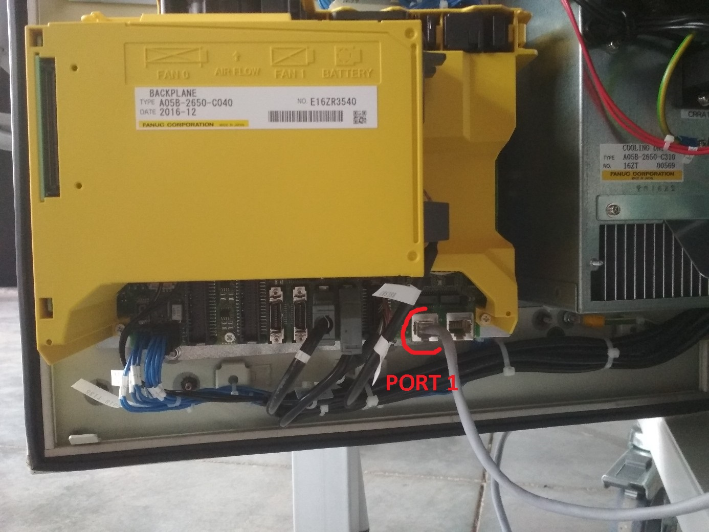

Change your laptop's IP settings to manual:
adress: 192.168.1.5 (last number may be any, but it shouldn't be equil to fanuc controller adress - 33)
subnet mask: 255.255.255.0

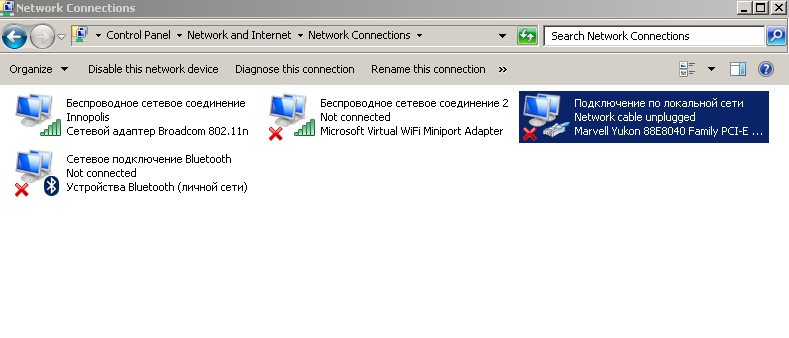

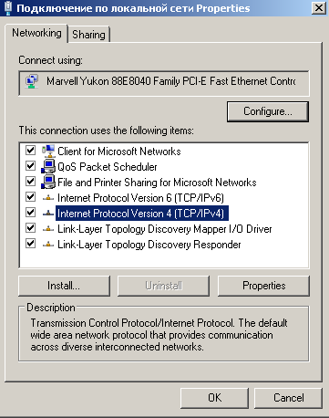


Then open windows file browser and write in adress line:
ftp://192.168.1.33
where 192.168.1.33 - robot controller IP adress.

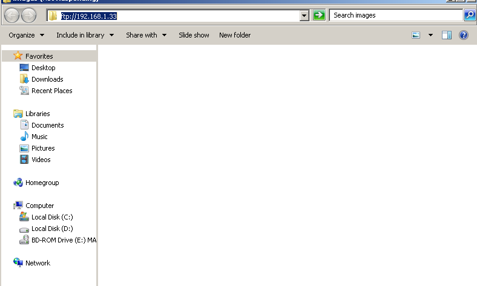

After entering you should see robot controller folder with about of 177 files 
(may be about 197 if ROS binaries was already installed on robot) 

### 4) Source installation

#### requirements:

a network connection between fanuc controller and PC
a copy of the fanuc_driver package, version 0.2 or newer 
(we've used 0.4.4 version of fanuc_package from <https://github.com/ros-industrial/fanuc>)
an installation of Fanuc Roboguide
 
Before the ROS-Industrial programs can be transferred to the robot controller, they need to be compiled into binaries.
We'll use Fanuc Roboguide for this. 

#### 4.1 Creating a Workcell
First, create a new workcell in Roboguide, either by using the wizard. 
When using the wizard, be sure to select the correct Application package, as well as the correct robot type.
On the software options screen, also make sure to select at least options R632 - KAREL and R648 - User Socket Messaging.

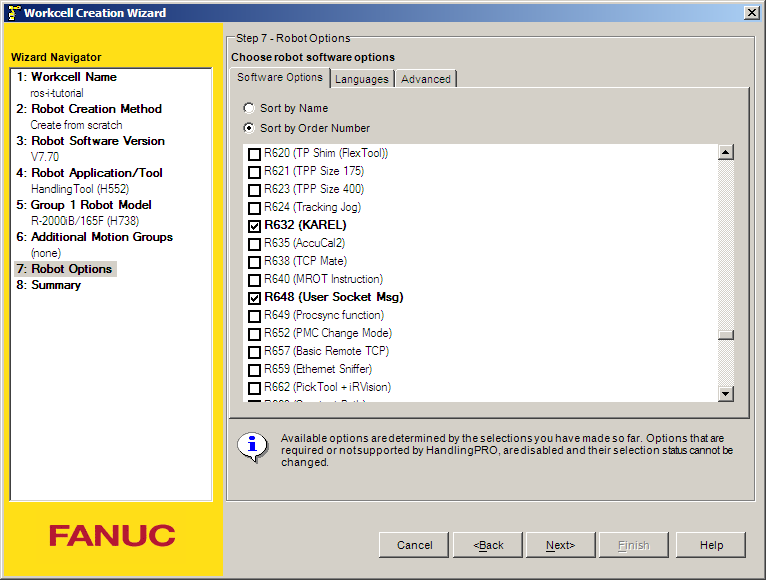

After completing the wizard, you should end up with an empty workcell with just your robot in the middle of it.

#### 4.2 Importing
In the Cell Browser, import the KAREL and TPE sources into the workcell using the Project→Add Files menu option.
Browse to your local fanuc_driver package and select all *.kl files in the karel subdirectory not ending in _h.kl or _t.kl.

Click the Open button to add them to the Cell Browser.

Now add the *.ls files in the tpe subdirectory as well. 
The Files section in the Cell Browser should contain at least the files shown.

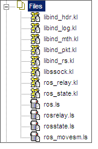

#### 4.3 Building

Now build all files by selecting Project→Build→All in Roboguide 
(if you have other source files under Files, build only those shown in the Importing section). 
No errors or warnings should be reported, and the Programs section in the Cell Browser should show the compiled binaries 
(TPREC is a default program and is not a part of ROS-Industrial)

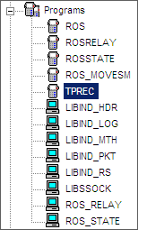

#### 4.4 Uploading binaries to controller

#### check out
Now you should find new files nearby your source files (in the same folder)
There is binaries check list for 0.4.4 version fanuc_driver package, please, make sure you obtain all of these files:
ros.tp
rosrelay.tp
rosstate.tp
ros_movesm.tp
libind_hdr.pc
libind_log.pc
libind_mth.pc
libind_pkt.pc
libind_rs.pc
libssock.pc
ros_relay.pc
ros_state.pc

Finally, the binaries need to be transferred to the controller. 
This can be done by direct transfer over a network connection (FTP)

Open windows file browser and write in adress line:
ftp://192.168.1.33
where 192.168.1.33 - IP of your robot (see p.3)
The robot controller folder appears.
Then copy your binaries into the robot controller folder

After copying the binaries onto the robot controller, open the Program Select window by pressing the Select button on the operator panel, then 
[TYPE]->KAREL Progs.

Make sure the following programs are listed (note that the revision numbers may be different):

ROS-Industrial Karel programs on the controller after installation

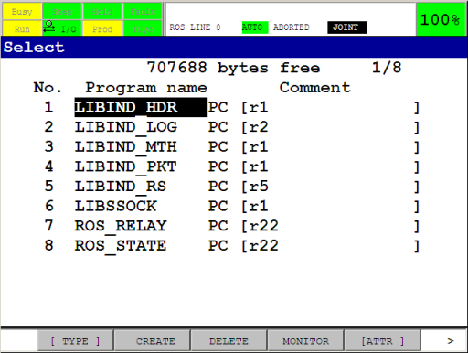

Then press [TYPE]->TP Programs and check next list

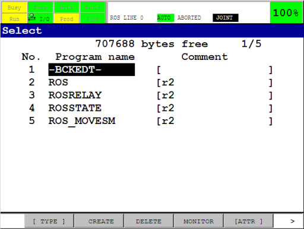

#### The ROS-Industrial programs are now installed on the controller.
if something goes wrong, please refer to original guide 
<http://wiki.ros.org/fanuc/Tutorials/hydro/Installation>


## STEP2. Installing ROS-Industrial to your laptop
if you need more information:
[check original ROS onstallation tutorial here](http://wiki.ros.org/Industrial/Install)

### 1) Install ROS-Industrial packages to your Ubuntu 16.04 laptop
 Industrial core:
```
sudo apt-get install ros-kinetic-industrial-core
```
 ABB stack:
```
sudo apt-get install ros-kinetic-abb
```
 Universal robot stack:
```
sudo apt-get install ros-kinetic-universal-robot
```
 ROS_canopen stack:
```
sudo apt-get install ros-kinetic-ros-canopen
```
### 2) Create catkin workspace
```
mkdir -p ~/catkin_ws/src
cd ~/catkin_ws/
catkin_make
```

### 3) Install **fanuc driver**
 Industrial core package installation:
``` 
cd ~/catkin_ws/src
git clone -b kinetic-devel https://github.com/ros-industrial/industrial_core.git
```
 Fanuc package installation:
```
git clone -b indigo-devel https://github.com/ros-industrial/fanuc.git
git clone -b indigo-devel https://github.com/ros-industrial/fanuc_experimental.git
cd ~/catkin_ws
catkin_make
```
 Checking dependencies. This may install additional packages:
 ```
cd ~/catkin_ws
rosdep install --from-paths src --ignore-src --rosdistro kinetic
catkin_make
```

### 4) Install *trac-ik* library:
```
sudo apt-get install ros-kinetic-trac-ik
```

### 5) To correct your current workspace in Terminal window open .bachrc file in your *Home* directory and write this command in the end of document:
source ~/catkin_ws/devel/setup.bash


## STEP3. Configuration of ROS-Industrial on Fanuc controllers
If you need more information:
[check original Configuration tutorial here](http://wiki.ros.org/fanuc/Tutorials/hydro/Configuration)

### 1) Server Tags

#### 1.1 Commons
So First we move toward    ros_state  and ros_relay because these two program make use of  the user socket messaging(USM)  software options and expect two server tags to be available. ROS-Industrial use 3 and 4 tags. File Transfer Protocol(FTP) use 1 and 2 Tags.
#### 1.2 Checking tag availability method
Menu->SETUP->Host Comm
Then go to the Setup Server Listing using:
SHOW->SERVERS 
#### 1.3 Tag configuring
Pick two available tags and write down their numbers finally make sure tags are configured as 
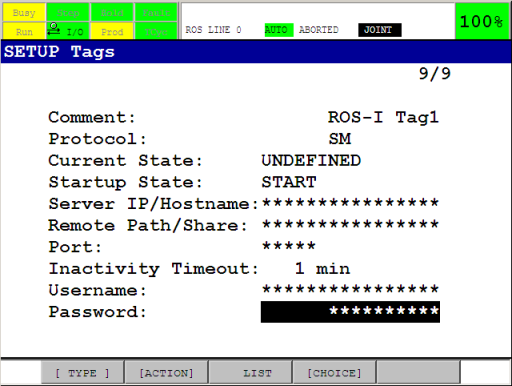
#### 1.4 Check out
Yes one step is completed now we move back to SETUP service and verify that the chosen Tags are in state STARTED. IF this not start then start each tag with:
ACTION-> DEFINE then ACTION->START 

**Important:** make sure they have been started by re-opening the SETUP Servers screen and check the current state of both tags: it should say STARTED.

### 2) Flags and Register:
*ros_relay* & *ros_movesm* programs are responsible for make use of several registers and flags:
By default flags 1 & 2 
Integer registers 1 & 2 
Position registers 1 & 2   are used.
Make sure these are not used by any other programs that may be running concurrently with the ROS-Industrial programs on the controller.
If any of the flags or registers are currently being used, find some alternatives, and note their numbers
**Important:** all flags and integer register can be used, but the position register need two registers at consecutive location 34 and 35.
“It is good practice to set a descriptive comment on the used flags and registers. This will make it easier later in this tutorial to verify that the correct flags and registers are used in the ROS-Industrial programs.”

### 3) Maximum Concurrent Task Number
By default, the controller can only run a small number of concurrent user tasks, which could prevent the ROS-Industrial programs from starting. The currently configured number of allowed tasks is stored in the $SCR.$MAXNUMTASK system variable. Any number above 3 should be enough to start the KAREL programs, but higher may be necessary if the controller also starts other tasks. The current value can be found in the SYSTEM Variables screen:
#### 3.1 Variables
Menu->NEXT->SYSTEM->Variables.
Scroll down to $SCR, press ENTER, then scroll to the $MAXNUMTASK entry. 
#### 3.2 Check out
Make sure $MAXNUMTASK variable has any number above 3. In our case default number was 4 .
#### 3.3 $MAXNUMTASK changing (optional)
To change the number, start the controller using a controlled start. Then open the Program Limits screen using Menu->NEXT->PROGRAM->SETUP. 
Then input a new value for the User Tasks entry. Now restart the controller using 
Fctn->START (COLD).

### 4) KAREL 
#### 4.1 The data in these two tables will need to be entered into the configuration structures of the respective programs.
The default configuration of the *ros_relay* program is shown in
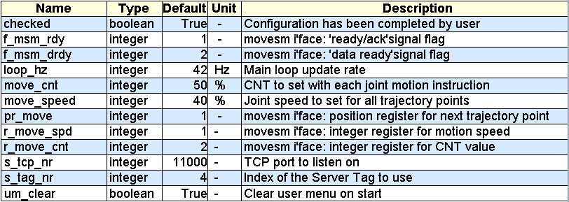

The default configuration of the *ros_state* program is shown in
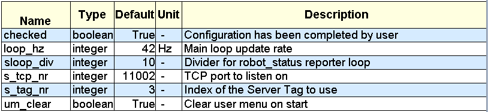

If the above defaults cannot be used, update the relevant entries with the new values. If for instance *Server Tag* 3 is not available, use the index number of a Tag that can be used.and TP Programs

#### 4.2 For entering these values we use this:
Type->KAREL progs. 
Select *ros_state* or *ros_relay* and press ENTER.
Press the DATA button
Type->KAREL Vars. You should now see the *cfg_variable*. Press ENTER.
If you selected *ros_state* then they show fig 1, to change the server tag used, navigate to the s_tag_nr press ENTER and input values. Press entering again when finished.


### 5) TP Programs
Unfortunately, the TPE programs cannot use the configuration data of the KAREL programs.
So they must be manually updated every time we change the used flags, integer or position registers.
Fortunately, only the ros_movesm program needs to be updated
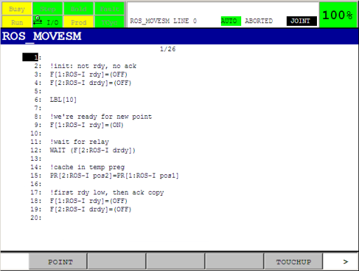

On the TP, open the ros_movesm program, and update all statements referencing the flags, integer or position registers with the new values.
In our case we renamed used flags *F1* & *F2* using
MENU->I/O->Flag
Make sure they correspond with the values you entered in the KAREL configuration in the previous section. 
**Important**
“Incorrect configuration of the flags, integer or position registers can result in damage to your robot, you and / or your workcell. 
**Please make sure they are free to use, before continuing with the next steps. **
**If you are unsure about register or flag usage by other programs, ask the operator of the robot to assist you.**

### 6) Motion Speed and Segment Termination
By default, the ros_relay program uses a CNT value of 50% and a fixed joint velocity of 20% for all motion commands. You can change this values (see point 4 Karel) to correct robot's velocity and avoid some errors related to it. 
For more information please visit this link:
[http://wiki.ros.org/Industrial/Tutorials/Improving_Motion_on_an_Industrial_Robot]( http://wiki.ros.org/Industrial/Tutorials/Improving_Motion_on_an_Industrial_Robot)

### 7) Fanuc robot now is configured to working with ROS. You can go to next step and try to run it.


## STEP4. Running
if you need more information:
[check original ROS running tutorial here](http://wiki.ros.org/fanuc/Tutorials/Running)

### 1) Testing packages
Test fanuc_X_support and fanuc_M_moveit_configuration (Instead of **X** your robot model from fanuc package must be written) nodes with real robot in mode T1. On the TP, start the *ros* TPE program. On Ubuntu PC, run:
```
roslaunch fanuc_cr7ial_moveit_config moveit_planning_execution.launch sim:=false robot_ip:=192.168.1.33
```

### 2)You can change mode to Auto using this way:
- Stop all connections bitween controller
- Select mode-switch on controller's front panel to *Auto* mode
- Select TP Switch to *OFF* position
- Stop all previos running programms using FCTN->ABORT (ALL). Make sure that there are no running programs.
- Press RESET to reset all present faults. Make sure, that there are no faults indicated on TP
- Increase velocity scale to 40-60% using *+%* button on TP to avoid position errors of controller
- Select *ROS* TP program on TP using SELECT->ROS->ENTER
- Press *CYCLE START* square green button on controller front panel to start the program
- Start ROS on your laptop


